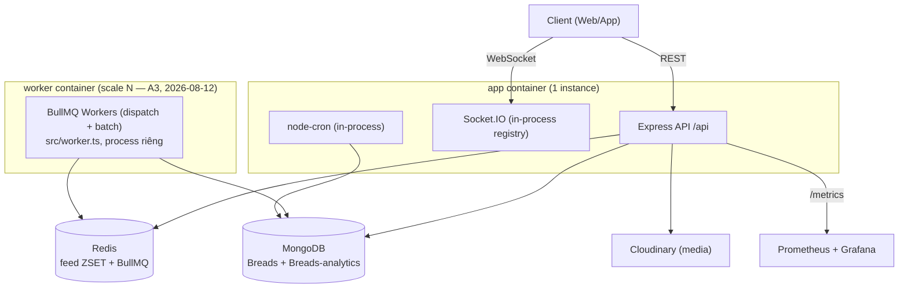

# Đánh giá Kiến trúc & Checklist Production-Readiness — Breads (DATN-Be)

> Góc nhìn: Solution Architect review toàn bộ backend (REST + Socket.IO + feed pipeline + hạ tầng).
> Ngày đánh giá: 2026-08-10. Snapshot theo `master` tại thời điểm review (sau epic `fanout-queue`).
> Mục tiêu tài liệu: (1) đánh giá hiện trạng kiến trúc, (2) liệt kê checklist việc cần làm để đưa
> project từ mức "đồ án tốt nghiệp" lên mức "sản phẩm vận hành production thật".
>
> Cập nhật 2026-08-12: đã xử lý S2, S3, S4, A3, A4 — chi tiết ở mục 3 (✅ Đã xác nhận khắc phục)
> và checkbox `[x]` tương ứng ở mục 4.
>
> Cập nhật 2026-08-12 (bổ sung): review chi tiết module Notification (REST + Socket.IO) — phát
> hiện S5, S6 (nghiêm trọng, chưa fix) và A11-A14 (đáng chú ý) ở mục 3, checklist tương ứng ở mục 4.

---

## 1. Tổng quan hệ thống

Backend monolith Node.js/TypeScript (ESM, mixed JS/TS) cho mạng xã hội "Breads":

- **API**: Express 4, REST dưới `/api`, JWT qua cookie httpOnly.
- **Real-time**: Socket.IO (messaging, notification, presence).
- **Dữ liệu**: MongoDB (Mongoose) — DB chính + DB analytics riêng; Redis cho feed ZSET/cache.
- **Hàng đợi**: BullMQ (2 tầng: dispatch → batch) cho fan-out bài viết.
- **Observability**: Prometheus + Grafana + redis/mongo exporter.
- **Quy trình**: một phần dự án (module feed) được phát triển qua CCPM (PRD → epic → issue →
  verify), có unit test (`node --test`) và k6 stress test thật. Phần còn lại của hệ thống (auth,
  message, notification, upload, cron...) không đi qua quy trình này và thiếu kiểm chứng tương ứng.

> Lưu ý: `Workers` không còn socket.io instance nên không tự emit được real-time "bài viết mới" (`FEED_SOCKET_ENABLED`) — xem A3 ở mục 3.

---

## 2. Điểm mạnh

| Điểm mạnh | Bằng chứng |
|---|---|
| Feed pipeline ("For You") thiết kế đúng bài toán social-feed kinh điển | Hybrid fan-out-on-write (user thường) + pull-on-read (celebrity >50k follower), candidate pool cố định trước khi phân trang, decay điểm động không ghi lại — `src/api/services/feed/*` |
| Fail-safe triệt để, có chủ đích | Mọi helper Redis non-throwing, timeout-race 200ms, catch-all lồng nhau ở tầng đọc — NFR-3 "Redis chết không bao giờ thành 5xx" |
| Kiến trúc queue 2 tầng hợp lý | Tách dispatch (1 job/post) khỏi batch (1 job/chunk follower), rate-limit đúng tầng, `jobId` dedupe, retry thật (verify report có bằng chứng "poison job" retry 3 lần) |
| Văn hoá kiểm chứng nghiêm túc (ở module feed) | 95 unit test, k6 stress test đo p50/p90 thật, epic verify report với coverage matrix 12/12 FR/NFR |
| Observability đủ dùng thật | Prometheus + Grafana + exporter cho cả Redis lẫn Mongo, custom gauge cho queue depth |
| Tự tài liệu hoá cả phần chưa xong | `docs/feed-pipeline-flow.md` mục 10 nêu rõ gap cron rebuild ZSET — kỷ luật kỹ thuật hiếm gặp |

---

## 3. Rủi ro & khoảng trống — theo mức độ ưu tiên

### 🔴 Nghiêm trọng

| # | Vấn đề | Vị trí | Vì sao đáng lo |
|---|---|---|---|
| S1 | Không có transaction cho thao tác đa-document | `src/api/services/user.ts:105,123` (`$inc followersCount` tách khỏi `Follow.create`/`deleteOne`) | Crash giữa 2 lệnh → đếm sai vĩnh viễn. Repo đã cần `migrate:backfill-like-follow-counts` để vá — vấn đề đã xảy ra thật. `followersCount` sai còn ảnh hưởng ngược lại ngưỡng celebrity của feed. |
| S2 | ✅ **ĐÃ FIX** — ~~Upload: path ghép trực tiếp `req.query.userId`, không `fileFilter`/`limits`~~ | `src/api/middlewares/upload.ts` | `validateUploadUserId` (validate ObjectId trước khi multer đụng body) + `fileFilter` whitelist ảnh/video/tài liệu (`cb(null,false)` — không dùng `cb(err)` vì multer không tự drain stream, sẽ treo connection) + `limits.fileSize/files` đã có sẵn từ trước. |
| S3 | ✅ **ĐÃ FIX** — ~~Không có rate limiting ở bất kỳ đâu~~ | toàn bộ `app.ts`/routers | `globalTierLimiter` áp cho toàn `/api` + `authTierLimiter` riêng cho login/signup/crawl/forgot-password. |
| S4 | ✅ **ĐÃ FIX** — ~~Graceful shutdown không thực sự "graceful"~~ | `src/server.ts` | `process.exit(0)` giờ nằm trong callback `server.close()`, force-exit timeout 10s, đóng sạch Mongo/Redis/BullMQ queue trước khi thoát. Xử lý cả `SIGTERM` (Docker/K8s) không chỉ `SIGINT`. |
| S5 | Route đọc thông báo không có xác thực — IDOR | `src/api/routers/notification.route.ts` | Không mount `protectRoute` (khác pattern đã dùng ở `post.route.ts` cho `LIKE`). `getNotifications` lấy thẳng `userId` từ body client, không đối chiếu `req.user` — bất kỳ ai (kể cả chưa đăng nhập) chỉ cần biết `userId` của người khác là đọc được toàn bộ thông báo riêng tư của họ (ai follow, ai like bài nào). |
| S6 | Tạo thông báo qua socket không xác thực `fromUser` — giả mạo/xoá thông báo người khác | `src/socket/controllers/notification.controller.ts:7-12` | Khác `PostController.likePost` (có check `authenticatedUserId !== userId`), handler `create` dùng thẳng `fromUser` từ payload, không đối chiếu `socket.user`. Vì middleware xác thực socket vẫn `next()` khi JWT thiếu/sai (`socket.ts:43-47`), client bất kỳ có thể emit thông báo giả hoặc lợi dụng nhánh dedupe (xoá-thay-vì-tạo khi trùng `fromUser+toUsers+action`) để xoá thông báo thật của người khác. |

### 🟠 Đáng chú ý

| # | Vấn đề | Vị trí | Ghi chú |
|---|---|---|---|
| A1 | ⏸ **HOÃN CÓ CHỦ ĐÍCH** — Không có Redis adapter cho Socket.IO | `src/socket/socket.ts`, `socket/services/user.ts` (`io.fetchSockets()`) | Registry socket chỉ tồn tại trong bộ nhớ tiến trình → không scale ngang được tầng real-time; 2 instance sẽ có 2 tập "online" tách biệt. **Quyết định 2026-08-12**: chưa cần vì project hiện chưa chạy nhiều instance `app` (chỉ 1 trong `docker-compose.yml`) — chỉ cấp thiết khi thật sự scale ngang HTTP/Socket.IO. |
| A2 | ⏸ **HOÃN CÓ CHỦ ĐÍCH** — Cron chạy in-process, không leader election | `src/app.ts` gọi `createDailyCollectionCron()`/`updateUsersCatesCron()` trực tiếp | Scale ngang N instance → cron chạy N lần song song, tạo trùng daily collection. **Quyết định 2026-08-12**: cùng lý do A1 — chỉ 1 instance `app` nên chưa có rủi ro trùng cron; distributed lock cũng tự mang rủi ro riêng (xem thảo luận trade-off trước đó trong session). |
| A3 | ✅ **ĐÃ FIX** — ~~BullMQ worker chạy chung tiến trình với HTTP server~~ | `src/worker.ts` (mới), `src/server.ts` | Worker chạy process riêng (`npm run worker`, service `worker` trong `docker-compose.yml`), scale độc lập bằng `--scale worker=N`. Đánh đổi: worker process không có Socket.IO nên push real-time "bài viết mới" (`FEED_SOCKET_ENABLED`, mặc định tắt) tự bỏ qua — cần A1 nếu muốn giữ tính năng này khi scale. |
| A4 | ✅ **ĐÃ FIX** — ~~`Message`/`Notification` model thiếu index cho query đường nóng~~ | `message.model.ts`, `notification.model.ts` | Đã thêm `{conversationId:1, createdAt:-1}` và `{toUsers:1, createdAt:-1}`. |
| A5 | Tìm kiếm tin nhắn: regex không escape, không text index | `message.controller.ts:186-196` | Input đưa thẳng vào `$regex` không escape → vector ReDoS + luôn full scan collection. |
| A6 | Cookie JWT thiếu `secure: true` | `src/api/utils/genarateTokenAndSetCookie.ts` | Có `httpOnly` + `sameSite: "strict"` nhưng thiếu `secure` — cần ép nếu không chắc chắn có HTTPS termination phía trước. |
| A7 | Cron rebuild/dọn ZSET feed (FR-8 gốc) chưa wire | `docs/feed-pipeline-flow.md` mục 10, `src/cronjob/index.ts` | Nhóm dev đã tự ghi nhận gap này. TTL là cơ chế dọn *duy nhất* đang chạy; hội tụ trạng thái celebrity chậm tới 7 ngày worst-case. |
| A8 | Không có health check endpoint / Docker HEALTHCHECK | `app.ts`, `Dockerfile` | Orchestrator (Docker/K8s) không có cách xác định app đã sẵn sàng nhận traffic hay đã treo. |
| A9 | Production image chạy trực tiếp bằng `tsx` (JIT transpile), không build | `Dockerfile` (`CMD ["npx", "tsx", "src/server.ts"]`) | `tsx`/`typescript` đang nằm trong `devDependencies` nhưng thực chất là runtime dependency của production — nếu ai đổi sang `npm ci --omit=dev` app sẽ vỡ ngay. Không compile trước cũng nghĩa là lỗi type chỉ lộ ra lúc chạy, không có gate nào chặn trước. |
| A10 | Container chạy với user root | `Dockerfile` | Không có `USER node`/non-root — vi phạm hardening cơ bản cho container production. |
| A11 | Vòng đời "đã đọc" của thông báo bị đứt gãy | `notification.controller.ts:103` (socket), toàn repo | `User.hasNewNotify` được set `true` ở 2 nơi nhưng không nơi nào set lại `false` — `NOTIFICATION_PATH.READ` đã khai báo trong `APIConfig.ts` nhưng chưa từng wire route/controller. Badge "thông báo mới" không bao giờ tắt cho user thật. Nguyên nhân sâu hơn còn do bug kiểu dữ liệu: `ObjectId(toUsers)` với `toUsers` là mảng → `mongoose.isValidObjectId` trả `false` → hàm tự tạo 1 ObjectId ngẫu nhiên mới, `User.updateOne` luôn update sai document (không tồn tại), nên dòng code này thực chất chưa từng có tác dụng qua đường socket `create` (đường trong `post.controller.ts:132-139` thì đúng vì dùng 1 ObjectId đơn). |
| A12 | Dedupe khi tạo thông báo bỏ qua `target` → mất thông báo hợp lệ | `notification.controller.ts:13-26` | Trước khi tạo, hệ thống tìm thông báo cùng `fromUser+toUsers+action` (không xét `target`) — có thì xoá thay vì tạo mới. Đúng cho FOLLOW (toggle follow/unfollow) nhưng handler dùng chung cho mọi action: 2 lần REPLY khác bài viết từ cùng 1 người tới cùng 1 người nhận sẽ khiến lần 2 xoá mất thông báo của lần 1 thay vì tạo thêm. |
| A13 | Push real-time hỏng âm thầm khi thông báo có nhiều người nhận | `notification.controller.ts:95`, `socket/services/user.ts:44-53` | `getUserSocketByUserId(toUsers, io)` nhận `toUsers` là mảng nhưng hàm được định nghĩa nhận 1 `userId: string`; so sánh `socket.userId === userId.toString()` chỉ đúng khi mảng có đúng 1 phần tử (`Array.toString()` nối bằng dấu phẩy). Schema `toUsers: [ObjectId]` cho phép nhiều người nhận nhưng cơ chế push chưa từng hoạt động đúng với trường hợp đó — chưa lộ vì mọi call site hiện tại đều tạo mảng 1 phần tử. |
| A14 | Data model chưa đủ cho UI "đã đọc"/lọc theo loại thông báo | `notification.model.ts`, `notification.validator.ts` | Không có field `isRead`/`readAt` per-document (chỉ có cờ `hasNewNotify` toàn cục ở `User`, xem A11) nên không thể hiển thị từng thông báo đã đọc/chưa đọc. `getNotificationsSchema` cũng không nhận filter theo `action` dù `Constants.NOTIFICATION_ACTION` đã định nghĩa `ALL/FOLLOW/REPLY/TAG/REPOST/LIKE` — không hỗ trợ được tab lọc trên UI nếu FE cần. |

### 🟡 Nợ kỹ thuật / nhất quán

- ~~**Codebase giữa 2 thời kỳ JS→TS**: models/routers/middlewares còn `.js`~~ — ✅ **ĐÃ XONG**: kiểm tra lại (2026-08-12) không còn file `.js` nào trong `src/`. Vẫn chưa có `tsc --noEmit` chạy tự động ở đâu (xem CI bên dưới).
- **Không có CI/CD** (`.github/` rỗng): 95 unit test + k6 script chất lượng cao nhưng không có gì tự động chạy chúng trên mỗi PR — uổng công đã đầu tư.
- **Không có lint config** (không ESLint) — style code phụ thuộc hoàn toàn vào tự giác.
- **Phân mảnh analytics theo ngày**: `analytics.model.ts` tạo 1 collection Mongo mới mỗi ngày — hợp lý cho throughput nhưng không truy vấn xuyên ngày bằng 1 query được, và số collection tăng vô hạn theo thời gian.
- **Single point of failure hạ tầng có chủ đích**: 1 Mongo (không replica set), 1 Redis, 1 app container trong `docker-compose.yml` — chấp nhận được cho portfolio/demo nhưng cần nói rõ đây là giới hạn biết trước, không phải oversight.
- **Logic tạo/emit/aggregate notification copy-paste 3 nơi**: `notification.controller.ts` (REST), `notification.controller.ts` (socket), `post.controller.ts` (socket, trong `likePost`) đều có cùng ~30 dòng aggregate (lookup `fromUser`/`post`, `$addFields.FromUserDetails`) — không có test nào bắt được lệch giữa 3 bản sao, đổi field response phải sửa đồng bộ cả 3 nơi.
- **`getNotifications` phân trang bằng `$skip`/`$limit` trần** (`notification.controller.ts:14-16`) — chi phí tăng tuyến tính theo độ sâu trang, chưa là vấn đề với data hiện tại nhưng đáng theo dõi nếu 1 user tích luỹ rất nhiều thông báo.

### ✅ Đã xác nhận khắc phục

- **`FEED_FANOUT_MODE: direct` đã được gỡ khỏi `docker-compose.yml`** (so với lần review trước) — hệ thống nay chạy đúng đường `queue` mặc định của epic `fanout-queue` thay vì đường đồng bộ cũ. Đây từng là finding P0 nghiêm trọng nhất, nay đã đóng.
- **S3 (rate limiting)** — `globalTierLimiter` + `authTierLimiter` đã wire cho toàn `/api` và các route auth-tier.
- **S2 (upload path traversal + fileFilter)** — `validateUploadUserId` + `fileFilter` whitelist mimetype (ảnh/video/tài liệu) trong `src/api/middlewares/upload.ts`, wire vào `util.route.ts`.
- **S4 (graceful shutdown)** — `src/server.ts` sửa lại đúng thứ tự `server.close()` → đóng Mongo/Redis/queue → `process.exit(0)`, có force-exit timeout, xử lý cả `SIGTERM`.
- **A3 (tách BullMQ worker)** — `src/worker.ts` là process riêng, không còn chạy chung HTTP server.
- **A4 (index Message/Notification)** — đã thêm 2 index theo đúng đề xuất.
- **JS→TS migrate** — không còn file `.js` nào trong `src/` (mục nợ kỹ thuật ở trên).

---

## 4. Checklist triển khai để đạt mức Production thật

> Đánh dấu `[x]` khi hoàn thành. Sắp theo nhóm, có gợi ý effort (Thấp/Trung bình/Cao).

### P0 — Phải làm trước khi có traffic thật

- [x] Thêm `express-rate-limit` (hoặc tương đương) cho `/auth/login`, `/auth/signup`, tạo post, tìm kiếm tin nhắn (S3) — *Thấp*
- [x] Thêm `limits` (fileSize, files) + `fileFilter` (whitelist mimetype) cho `multer`; sanitize/validate `userId` trước khi ghép vào path upload (S2) — *Thấp*
- [x] Sửa `SIGINT` handler: chuyển `process.exit()` vào trong callback của `server.close()`, exit code `0` cho shutdown bình thường; thêm timeout ép thoát nếu connection không đóng kịp (S4) — *Thấp*
- [ ] Bọc các thao tác đếm-đi-kèm-document (follow/unfollow, like/unlike, v.v.) trong `mongoose.startSession().withTransaction()` (S1) — *Trung bình*
- [ ] Thêm `secure: true` cho cookie JWT khi `NODE_ENV=production` (A6) — *Rất thấp*
- [ ] Thêm `protectRoute` cho `notification.route.ts`, lấy `userId` từ `req.user` thay vì body — bỏ hẳn param `userId` khỏi request (S5) — *Thấp*
- [ ] Check `fromUser === socket.user?.userId` ở đầu `NotificationController.create` (socket), mirror pattern đã có ở `likePost` (S6) — *Rất thấp*

### P1 — Nên làm sớm, ảnh hưởng trực tiếp đến độ tin cậy/hiệu năng

- [x] Thêm index `{conversationId: 1, createdAt: -1}` cho `Message`, `{toUsers: 1, createdAt: -1}` cho `Notification` (A4) — *Rất thấp*
- [ ] Escape input trước khi đưa vào `$regex`, hoặc chuyển tìm kiếm tin nhắn sang Mongo `$text` index (A5) — *Thấp*
- [ ] Wire cron rebuild/cleanup ZSET đúng đặc tả FR-8 gốc (A7) — *Trung bình*
- [ ] Thêm endpoint `/health` (readiness: check Mongo + Redis ping) và `HEALTHCHECK` trong `Dockerfile` (A8) — *Thấp*
- [ ] Thiết lập CI (GitHub Actions): chạy `npm test` + `npx tsc --noEmit` trên mỗi PR, chặn merge khi fail (nợ kỹ thuật CI/CD) — *Thấp*
- [ ] Thêm ESLint (+ Prettier nếu chưa nhất quán format) và chạy trong CI — *Thấp*
- [ ] Thêm field `isRead`/`readAt` vào `Notification`, wire route `PATCH /notifications/read` (path đã có sẵn trong `APIConfig.ts`), sửa lại điểm set `hasNewNotify` cho đúng user (vá luôn bug `ObjectId(toUsers)` là mảng) (A11) — *Trung bình*
- [ ] Sửa dedupe khi tạo notification để xét thêm `target`, hoặc giới hạn nhánh xoá-thay-vì-tạo chỉ cho `action === FOLLOW` (A12) — *Thấp*
- [ ] Sửa `getUserSocketByUserId`/call site để nhận đúng nhiều `toUsers` thay vì chỉ hoạt động đúng với 1 người nhận (A13) — *Thấp*
- [ ] Thêm filter theo `action` vào `getNotificationsSchema` nếu FE cần tab lọc (A14) — *Thấp* — cần xác nhận với FE/PM trước khi làm

### P2 — Cần thiết trước khi tự tin gọi là "production"

- [ ] Chuyển `tsx`/`typescript` từ `devDependencies` sang `dependencies` **hoặc** thêm bước `tsc` build thật và chạy image bằng JS đã compile, không JIT-transpile lúc chạy (A9) — *Trung bình*
- [ ] Thêm `USER node` (non-root) trong `Dockerfile`, review lại toàn bộ Dockerfile theo hardening checklist cơ bản (A10) — *Thấp*
- [ ] Cấu hình secret management thật (không `.env` commit/copy tay) — Docker secrets, hoặc vault/parameter store tuỳ nơi deploy — *Trung bình*
- [ ] Thêm structured logging (JSON) + tích hợp error tracking (Sentry hoặc tương đương) thay cho `console.log`/`console.error` rải rác — *Trung bình*
- [ ] Viết test cho các luồng ngoài feed: auth, message, notification, upload, report/moderation — hiện chỉ feed có coverage đáng kể — *Cao*
- [ ] Thêm API documentation (OpenAPI/Swagger) cho toàn bộ router — *Trung bình*

### P3 — Chuẩn bị cho scale ngang thật sự (nhiều instance)

- [ ] ⏸ Thêm `@socket.io/redis-adapter` để chia sẻ registry socket giữa các instance (A1) — *Trung bình* — **hoãn có chủ đích 2026-08-12**, chưa cần vì chưa scale ngang `app`
- [ ] ⏸ Chuyển cron sang cơ chế có leader election (ví dụ lock qua Redis, hoặc scheduler ngoài — K8s CronJob riêng) thay vì `node-cron` in-process (A2) — *Trung bình* — **hoãn có chủ đích 2026-08-12**, cùng lý do A1
- [x] Tách BullMQ worker (`initFanoutWorkers`) ra khỏi process HTTP server thành service/deployment riêng, scale độc lập theo queue depth (A3) — *Cao*
- [ ] Chuyển MongoDB sang replica set (tối thiểu 3 node) để có failover thật + hỗ trợ transaction đáng tin cậy hơn (S1 phụ thuộc vào đây) — *Cao*
- [ ] Đưa Redis lên chế độ có HA (Sentinel/Cluster) nếu feed/queue là đường sống còn — *Cao*
- [ ] Thêm load balancer + horizontal pod/container autoscaling trước app tier — *Cao*

### Nợ kỹ thuật / dọn dẹp lâu dài (không chặn go-live nhưng nên có lộ trình)

- [x] Hoàn tất migrate JS → TS cho toàn bộ `models`/`routers`/`middlewares` để nhất quán với tầng feed — *Cao*
- [ ] Đánh giá chiến lược rotate/archive cho collection analytics theo-ngày trước khi số lượng collection trở thành vấn đề vận hành — *Trung bình*
- [ ] Ghi rõ trong tài liệu vận hành: hệ thống hiện là single-instance-by-design (Mongo/Redis/app đều 1 node) — để người review sau không hiểu nhầm là oversight — *Rất thấp*

---

## 5. Ghi chú

Tài liệu này là bản chụp tại thời điểm review; nhiều chi tiết (đặc biệt số dòng file) có thể lệch nếu
code tiếp tục thay đổi — dùng path/tên hàm để tra cứu lại vị trí chính xác khi bắt tay triển khai
checklist. Nên review lại tài liệu này sau khi hoàn thành mỗi nhóm ưu tiên (P0 → P1 → P2 → P3).
