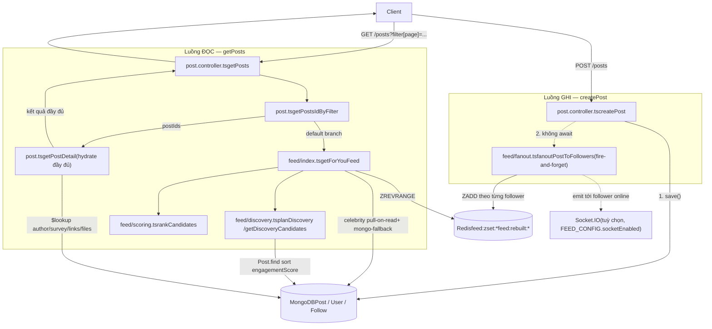
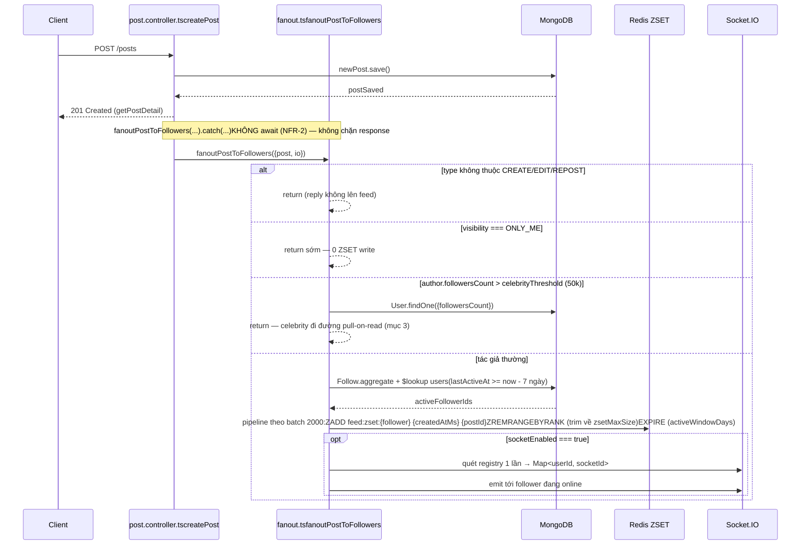
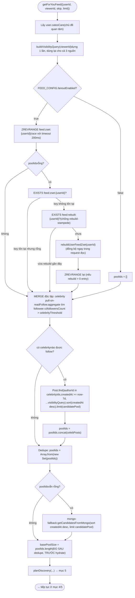
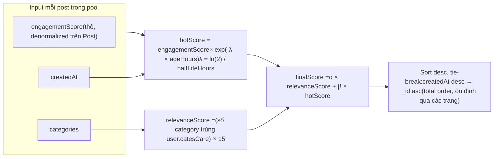
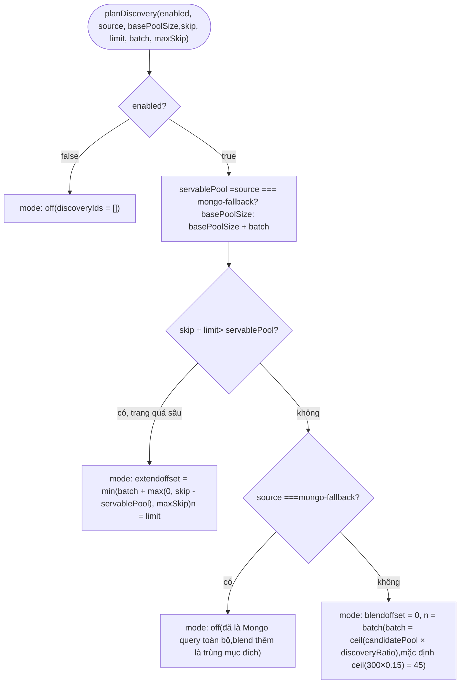
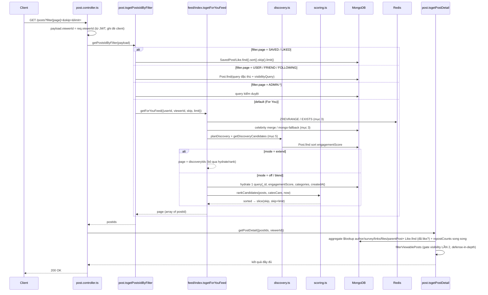
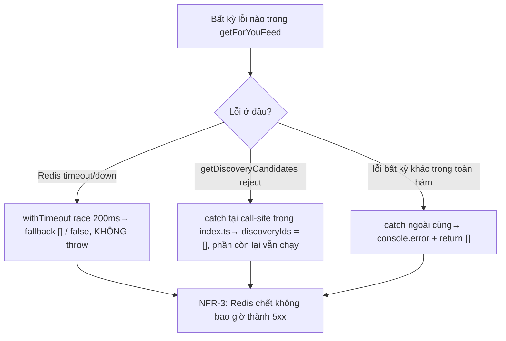

# Luồng chuẩn bị Feed "For You" — Tài liệu kỹ thuật chi tiết

> Snapshot theo trạng thái code sau epic `feed-discovery` (commit `1bd07e7`). Mọi tham chiếu file:line dùng để tra cứu nhanh, có thể lệch nếu code đổi tiếp.

## 0. Phạm vi & các thành phần liên quan

| Lớp                            | File                                     | Vai trò                                                                                                                                |
| ------------------------------ | ---------------------------------------- | -------------------------------------------------------------------------------------------------------------------------------------- |
| Controller                     | `src/api/controllers/post.controller.ts` | Entry point HTTP: `createPost` (ghi), `getPosts` (đọc)                                                                                 |
| Orchestration đọc              | `src/api/services/post.ts`               | `getPostsIdByFilter` (router theo `filter.page`), `buildVisibilityQuery`, `getCandidatesFromMongo`, `getPostDetail` (hydrate chi tiết) |
| Orchestration feed cá nhân hoá | `src/api/services/feed/index.ts`         | `getForYouFeed` — trái tim của luồng "For You"                                                                                         |
| Fan-out-on-write               | `src/api/services/feed/fanout.ts`        | `fanoutPostToFollowers`, `rebuildUserFeedZset`                                                                                         |
| Discovery (lấp pool)           | `src/api/services/feed/discovery.ts`     | `planDiscovery`, `getDiscoveryCandidates`, `accountDiscovery`                                                                          |
| Chấm điểm                      | `src/api/services/feed/scoring.ts`       | `hotScore`, `relevanceScore`, `finalScore`, `rankCandidates`                                                                           |
| Redis ZSET                     | `src/api/services/feed/zset.ts`          | Wrapper non-throwing cho `ZADD/ZREVRANGE/EXISTS/DEL`                                                                                   |
| Cấu hình                       | `src/api/services/feed/config.ts`        | `FEED_CONFIG` — đọc `process.env` một lần lúc import                                                                                   |
| Kết nối Redis                  | `src/dbs/redis.ts`                       | `enableOfflineQueue: false` để fail-fast                                                                                               |
| Cron                           | `src/cronjob/index.ts`                   | **Không** có job rebuild/cleanup ZSET feed (xem mục 8)                                                                                 |

Hai luồng tách biệt: **luồng ghi** (fan-out-on-write khi tạo post) và **luồng đọc** (hybrid candidate generation + ranking + discovery khi client gọi `GET /posts`).

---

## 1. Kiến trúc tổng quan



---

## 2. Luồng GHI — Fan-out-on-write

Điểm mấu chốt: **không phải mọi post đều ghi ZSET**. Ba nhánh loại trừ sớm để tránh ghi thừa:



**Ba guard loại trừ ghi** (`fanout.ts:97,104,121`):

1. `type` không phải `CREATE/EDIT/REPOST` → reply không lên feed ai.
2. `visibility === ONLY_ME` → không ai xem được nên 0 ZSET write.
3. `followersCount > FEED_CONFIG.celebrityThreshold` (mặc định 50.000) → tác giả celebrity **không bao giờ** được fan-out; follower của họ chỉ thấy bài qua pull-on-read lúc đọc (mục 3, bước celebrity merge).

**Follower đích** chỉ gồm người có `lastActiveAt` trong `activeWindowDays` (7 ngày) gần nhất — lọc ngay trong aggregation Mongo (`$lookup` + sub-pipeline `$match`), không lọc ở Node. Đây vừa là tối ưu, vừa là điều kiện bắt buộc để TTL của ZSET (`EXPIRE activeWindowDays`) thực sự có tác dụng: nếu không lọc, mọi `ZADD` sẽ hồi sinh ZSET của user không hoạt động, vô hiệu hoá TTL.

**Score ghi vào ZSET** = `createdAt` epoch ms **thô**, không phải điểm đã decay — decay chỉ tính động lúc đọc (mục 4).

---

## 3. Luồng ĐỌC — `getForYouFeed`: sinh candidate pool

Đây là bước phức tạp nhất. Điểm thiết kế cốt lõi: **pool candidate có kích thước cố định** (`FEED_CONFIG.candidatePool`, mặc định 300), không phụ thuộc `skip/limit` — toàn bộ pool được chấm điểm rồi mới cắt trang (`slice(skip, skip+limit)`), thay vì phân trang trước rồi chấm điểm sau (cách cũ khiến ranking gần như vô hiệu).



**Nguồn candidate ưu tiên theo thứ tự**, nhưng **không loại trừ lẫn nhau** (celebrity merge luôn chạy độc lập kể cả khi ZSET đã có dữ liệu):

| Nguồn                  | Khi nào kích hoạt                                  | Ghi log `source`      |
| ---------------------- | -------------------------------------------------- | --------------------- |
| `zset`                 | Fan-out bật, ZSET user có dữ liệu                  | `zset`                |
| celebrity pull-on-read | Viewer follow ít nhất 1 celebrity                  | nối thêm `+celebrity` |
| `mongo-fallback`       | ZSET rỗng **và** celebrity merge cũng không cho gì | `mongo-fallback`      |

**Lazy rebuild + sentinel chống stampede**: khi `ZREVRANGE` rỗng, hệ thống kiểm tra `EXISTS feed:zset:{userId}`. Nếu key chưa từng tồn tại (chưa từng rebuild, hoặc đã bị dọn), gọi `rebuildUserFeedZset` **đồng bộ ngay trong request đọc** — quét lại `Follow` + `Post` từ Mongo. Vì `ZADD` với 0 phần tử **không tạo key** trong Redis, nếu một user luôn rebuild ra 0 entry (user mới, hoặc chỉ follow celebrity), việc chỉ dựa vào `EXISTS` sẽ khiến **mọi request tiếp theo của chính user đó** kích hoạt rebuild lại — một stampede tự gây ra. Sentinel `feed:rebuilt:{userId}` (TTL 60s) được ghi mỗi lần rebuild ra 0 entry để chặn vòng lặp này.

**Mọi bước Redis đều race với `REDIS_READ_TIMEOUT_MS = 200ms`** rồi rơi về fallback rỗng — vì `enableOfflineQueue: false` không đủ để cứu request khi Redis _đã kết nối_ nhưng chết giữa chừng (đo thực tế: có thể treo 19-29s nếu không có timeout race).

---

## 4. Chấm điểm — `finalScore`



- `hotScore` **không bao giờ lưu lại** — tính động mỗi lần đọc từ `engagementScore` thô + tuổi bài, nên bài tự động "chìm" theo thời gian mà không cần ghi gì.
- `bucketedNow(nowMs, scoreBucketSeconds=60)`: làm tròn thời điểm "now" về đầu khung 60 giây, để các request phân trang liên tiếp trong cùng khung chấm điểm với cùng một `now` → thứ tự ổn định giữa các trang. Nếu một phiên scroll kéo dài hơn 60s, hoặc có bài mới lọt vào ZSET giữa hai trang, một bài có thể lặp lại ở trang sau — đây là đánh đổi có chủ ý (không dùng cursor/snapshot token).
- `α` (`FEED_ALPHA`, mặc định 1) và `β` (`FEED_BETA`, mặc định 1) chỉnh được qua env, không cần redeploy.
- Việc chấm điểm diễn ra **trên toàn bộ pool** rồi mới `.slice(skip, skip+limit)` — không chấm điểm riêng từng trang.

---

## 5. Discovery — lấp chỗ trống khi pool cạn

`planDiscovery` là hàm **thuần** (không I/O), nhận `source`/`basePoolSize`/`skip`/`limit` làm tham số thay vì tự đọc `FEED_CONFIG`, để test được với mọi tổ hợp mà không phụ thuộc biến môi trường parse lúc import.



**Ba chế độ:**

| Mode     | Điều kiện                                                                                   | Hành vi ở `index.ts`                                                                                                                                                                                                                                                                                                  |
| -------- | ------------------------------------------------------------------------------------------- | --------------------------------------------------------------------------------------------------------------------------------------------------------------------------------------------------------------------------------------------------------------------------------------------------------------------- |
| `off`    | Discovery tắt, hoặc nguồn đã là `mongo-fallback` và trang chưa quá sâu                      | Không gọi `getDiscoveryCandidates`. `plan.n === 0` là **guard bắt buộc** — bỏ nó thì `FEED_DISCOVERY_RATIO=0` (cách user tắt blend qua config) sẽ vô tình phát một query `.limit(0)` = **không giới hạn** trên Mongo, sort không index.                                                                               |
| `blend`  | Pool còn "servable" (chưa tới trang sâu)                                                    | `getDiscoveryCandidates` lấy `batch` bài chưa nằm trong pool, **nối vào `poolIds` TRƯỚC bước hydrate** — bài discovery đi chung một query hydrate với bài pool gốc, tự có đủ field để `rankCandidates` chấm điểm cạnh tranh sòng phẳng (không có ưu tiên đặc biệt; nếu không khớp category thì `relevanceScore = 0`). |
| `extend` | `skip + limit > servablePool` (trang vượt quá những gì pool + 1 batch blend có thể phục vụ) | **Bỏ qua hoàn toàn hydrate + rankCandidates**: `getDiscoveryCandidates` trả thẳng danh sách đã sort theo `engagementScore` từ Mongo, dùng nguyên làm `page`. Đây là _thay thế_ trang, không nối vào phần đã rank trước đó (tránh phải giữ state giữa các request).                                                    |

**Nguồn của `getDiscoveryCandidates`** (`discovery.ts:136`): một query Mongo duy nhất —

```
Post.find({
  _id: { $nin: poolIds },        // loại bài đã có trong pool
  authorId: { $ne: userId },     // không đề xuất bài của chính mình
  type: { $in: [CREATE, EDIT, REPOST] },  // loại reply
  ...visibilityQuery,            // fail-closed, tái dùng nguyên visibilityQuery đã dựng ở trên
}).sort({ engagementScore: -1, _id: -1 }).skip(offset).limit(n)
```

`_id` là tie-break **bắt buộc** trong sort — `engagementScore` không unique, thiếu tie-break thì `skip/limit` liên tiếp có thể trả trùng/bỏ sót document dù dữ liệu không đổi.

Hàm này **được phép throw** (khác hợp đồng non-throwing của phần còn lại) — try/catch nằm ở **call-site** (`index.ts`), không nằm trong hàm, để lỗi discovery không bao giờ làm hỏng phần feed cá nhân hoá đã có (`discoveryIds = []` khi lỗi, phần còn lại của response vẫn chạy bình thường).

`accountDiscovery(page, discoveryIds)` chỉ dùng để **log quan sát** (`discoveryShown`, `discoveryBestRank`, `discoveryAvgRank`) — không ảnh hưởng response trả về client.

---

## 6. Toàn bộ luồng đọc end-to-end



**Vì sao có hai lớp kiểm tra visibility?** `visibilityQuery` được áp trong `getForYouFeed`/`getDiscoveryCandidates`, nhưng ZSET được ghi lúc fan-out — tác giả có thể đổi `visibility` **sau khi** post đã fan-out. `getPostDetail` luôn hydrate lại và chạy `filterViewablePosts` một lần nữa trên document tươi, nên bước gate thật sự bắt buộc nằm ở hydrate, không phải ở bước sinh candidate.

---

## 7. Cấu trúc dữ liệu Redis

| Key                     | Kiểu                                                     | Ghi bởi                                                    | Đọc bởi                   | TTL                                                                                               |
| ----------------------- | -------------------------------------------------------- | ---------------------------------------------------------- | ------------------------- | ------------------------------------------------------------------------------------------------- |
| `feed:zset:{userId}`    | Sorted Set (`member=postId`, `score=createdAt epoch ms`) | `zAddPostForUsers` (fan-out), `zReplaceUserFeed` (rebuild) | `zRevRangeTop`, `zExists` | `activeWindowDays` (7 ngày), reset mỗi lần ghi; cắt về `zsetMaxSize` (500) bằng `ZREMRANGEBYRANK` |
| `feed:rebuilt:{userId}` | String sentinel (`"1"`)                                  | `setRebuiltSentinel` khi rebuild ra 0 entry                | `sentinelExists` (mục 3)  | 60 giây                                                                                           |

Mọi helper trong `zset.ts`/`fanout.ts`/`index.ts` đọc/ghi Redis đều **non-throwing**: trả `[]`/`false`/`void` và log lỗi, không bao giờ reject — ngoại lệ duy nhất là `getDiscoveryCandidates` (Mongo, không phải Redis) như đã nêu ở mục 5.

---

## 8. Cấu hình — `FEED_CONFIG`

| Key                  | Env var                             | Default | Ý nghĩa                                                             |
| -------------------- | ----------------------------------- | ------- | ------------------------------------------------------------------- |
| `alpha`              | `FEED_ALPHA`                        | 1       | Trọng số `relevanceScore` trong `finalScore`                        |
| `beta`               | `FEED_BETA`                         | 1       | Trọng số `hotScore` trong `finalScore`                              |
| `halfLifeHours`      | `FEED_HALF_LIFE_HOURS`              | 6       | Chu kỳ bán rã của `hotScore`                                        |
| `celebrityThreshold` | `FEED_CELEBRITY_FOLLOWER_THRESHOLD` | 50.000  | Ngưỡng follower để tác giả đi đường pull-on-read thay vì fan-out    |
| `zsetMaxSize`        | `FEED_ZSET_MAX_SIZE`                | 500     | Trần số phần tử mỗi ZSET user                                       |
| `candidatePool`      | `FEED_CANDIDATE_POOL`               | 300     | Kích thước pool cố định trước khi phân trang                        |
| `scoreBucketSeconds` | `FEED_SCORE_BUCKET_SECONDS`         | 60      | Khung làm tròn "now" để phân trang ổn định                          |
| `fanoutEnabled`      | `FEED_FANOUT_ENABLED`               | true    | Kill-switch cho toàn bộ nhánh ZSET (ghi lẫn đọc)                    |
| `socketEnabled`      | `FEED_SOCKET_ENABLED`               | false   | Bật push real-time qua Socket.IO khi fan-out                        |
| `activeWindowDays`   | _(hard-code)_                       | 7       | Cửa sổ "đang hoạt động" cho follower + TTL ZSET                     |
| `discoveryEnabled`   | `FEED_DISCOVERY_ENABLED`            | true    | Kill-switch cho toàn bộ blend/extend discovery                      |
| `discoveryRatio`     | `FEED_DISCOVERY_RATIO`              | 0.15    | Tỷ lệ batch discovery / candidatePool (clamp [0,1])                 |
| `discoveryMaxSkip`   | `FEED_DISCOVERY_MAX_SKIP`           | 1000    | Trần `offset` khi ở mode `extend`, chặn deep-skip quá sâu vào Mongo |

`FEED_CONFIG` được `Object.freeze` và parse **một lần lúc import module** — mọi hàm cần test theo nhiều giá trị config (như `planDiscovery`) phải nhận giá trị qua tham số, không tự đọc `FEED_CONFIG` bên trong.

---

## 9. Fail-safe & các đường lỗi



Toàn bộ đường đọc feed có **2 lớp catch-all lồng nhau** (`getPostsIdByFilter` bên ngoài, `getForYouFeed` bên trong) — hệ quả là "bug thật" và "Redis down, đúng thiết kế" đều cho ra cùng kết quả rỗng `200 OK`. Log `[feed]` ở cuối `getForYouFeed` (kèm `source`, `poolSize`, `candidateMs`, `hydrateMs`, `discoveryMode`, `discoveryFetched/Shown/BestRank/AvgRank`) là **cách duy nhất** phân biệt hai trường hợp từ bên ngoài.

---

## 10. Khoảng trống đã biết (so với PRD gốc)

PRD `feed-ranking-fanout` (FR-8) đặc tả một cron 15 phút để **rebuild ZSET cho user active** và **xoá ZSET cho user inactive > 7 ngày**. Kiểm tra `src/cronjob/index.ts` cho thấy **cron này chưa được wire** — chỉ có `createDailyCollectionCron` và `updateUsersCatesCron`, không job nào gọi `rebuildUserFeedZset`/`zDeleteUserFeeds`. Hệ quả:

- **Không có cơ chế dọn ZSET chủ động** — TTL (`activeWindowDays`) là cơ chế dọn _duy nhất_ đang hoạt động, phụ thuộc hoàn toàn vào việc không còn `ZADD` nào ghi tiếp cho user đó (đúng như thiết kế lọc `lastActiveAt` ở fan-out — mục 2).
- **Hội tụ trạng thái lai chậm hơn dự kiến**: khi một tác giả vượt/tụt ngưỡng celebrity (R-7 trong PRD), PRD kỳ vọng cron 15 phút ghi đè ZSET để hội tụ; thực tế chỉ hội tụ khi **viewer đó** tình cờ trigger lazy rebuild (ZSET của họ hết hạn hoặc chưa từng tồn tại) — có thể mất tới `activeWindowDays` (7 ngày) trong trường hợp xấu nhất.
- Rebuild **duy nhất đang chạy** là lazy, đồng bộ, trong chính request đọc (mục 3) — chấp nhận được vì có sentinel chống stampede, nhưng là một request đọc phải "trả giá" bằng một lượt quét Mongo đầy đủ, khác với cron nền chạy off-path.

Đây không phải bug — là gap giữa đặc tả và triển khai, đáng ghi vào phần đánh giá/báo cáo nếu phân tích sâu thêm phần này.

---

## 11. Tổng hợp: các file cần đọc nếu muốn sửa gì

| Muốn thay đổi...                                       | Sửa ở                                                                                                         |
| ------------------------------------------------------ | ------------------------------------------------------------------------------------------------------------- |
| Trọng số ranking (α/β/half-life)                       | `.env` → `FEED_CONFIG` (`config.ts`), không cần sửa code                                                      |
| Công thức chấm điểm                                    | `scoring.ts`                                                                                                  |
| Điều kiện fan-out (celebrity threshold, active window) | `config.ts` + `fanout.ts`                                                                                     |
| Tỷ lệ/logic discovery                                  | `discovery.ts` (tầng thuần `planDiscovery` test độc lập, tầng I/O `getDiscoveryCandidates`)                   |
| Nguồn candidate / thứ tự merge                         | `feed/index.ts` (`getForYouFeed`)                                                                             |
| Quy tắc "ai xem được bài nào"                          | `post.ts` → `buildVisibilityQuery`/`canViewPost`/`filterViewablePosts` (dùng chung mọi read-path, kể cả feed) |
| Cron dọn/rebuild ZSET (hiện chưa có)                   | `src/cronjob/index.ts` — cần thêm mới nếu muốn khớp FR-8                                                      |
